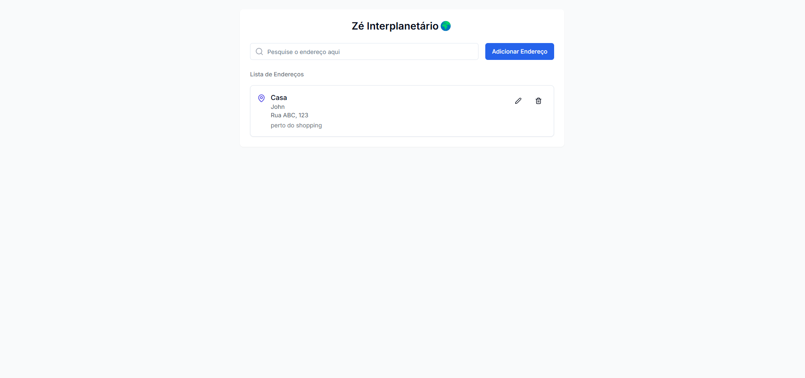

# 🚀 Desafio: Sistema de Delivery Interplanetário  



## 📖 Sobre o Projeto  
Com a expansão da SpaceX na década de 2050 e o barateamento dos custos, a humanidade passou a exportar grande parte da produção e estoques de dispositivos eletrônicos para Marte. Para facilitar esse processo, você está desenvolvendo um **sistema de delivery entre planetas** que permite o cadastro de endereços para entregas **de Marte para a Terra e vice-versa**.  

## 🛠️ Tecnologias Utilizadas  
- **Next.js** (React Framework)  
- **TypeScript** (Tipagem estática)  
- **Tailwind CSS** (Estilização)  

## 🚀 Como Instalar e Executar o Projeto  

### 1️⃣ Clone o Repositório  
```bash
git clone https://github.com/jovimoura/ze-interplanet
```
  
### 2️⃣ Acesse o Diretório  
```bash
cd <pasta>
```
  
### 3️⃣ Instale as Dependências  
```bash
npm install
```
  
### 4️⃣ Execute o Projeto  
```bash
npm run dev
```
  
### 5️⃣ Acesse no Navegador  
O projeto estará rodando em:  
👉 [http://localhost:3000](http://localhost:3000)  

## 🎨 Design de Referência  
Para o layout, utilizei como inspiração a [Image](https://dribbble.com/shots/22826699-Shipping-address-Exploration) e na criação do projeto utilizei Shadcn e TailwindCSS

## 📌 Funcionalidades Implementadas  
✅ Cadastro de endereços para entregas interplanetárias  
✅ Validação automática de endereço baseado no planeta  
✅ Armazenamento local dos endereços  

## 📜 Licença  
Este projeto é de código aberto e está disponível sob a **MIT License**.  

🚀 **Boa viagem espacial e bons deliveries!** 🌌